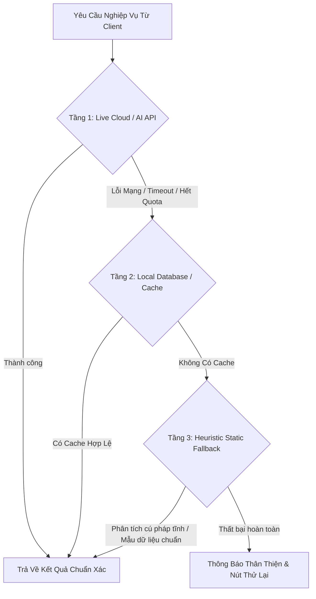

# 🛡️ Zero-Regression Software Engineering & Resilient Architecture Handbook

Cẩm nang phương pháp luận kỹ thuật phần mềm chuẩn doanh nghiệp, đúc kết các nguyên tắc tối thượng nhằm đảm bảo quá trình phát triển, nâng cấp và mở rộng hệ thống **không bao giờ làm hỏng, cắt xén hay suy giảm bất kỳ tính năng nào đã hoạt động ổn định trước đó**, áp dụng cho mọi ngôn ngữ lập trình (Python, TypeScript, JavaScript, Rust, Go) và mọi nền tảng (Web App, Mobile Web, Desktop, Cloud Microservices).

---

## 🏛️ 1. Nguyên Tắc Vàng Bảo Toàn Tính Năng (The Law of Non-Destructive Additions)

Trong kỹ thuật phần mềm phức tạp, việc bổ sung tính năng mới thường tiềm ẩn nguy cơ "gãy vỡ vô hình" (Silent Regression). Để triệt tiêu rủi ro này, mọi kỹ sư phải tuân thủ 4 quy tắc sắt:

### A. Quy Tắc Bổ Sung Không Xâm Lấn (Additive-Only Changes)
- Khi mở rộng một hàm, lớp hoặc API, **luôn sử dụng tham số tùy chọn kèm giá trị mặc định** bảo toàn hành vi cũ:
  ```python
  # ✅ ĐÚNG: Giữ nguyên hành vi cũ nếu không truyền tham số mới
  def render_graph_view(nodes, edges, standalone_mode: bool = False, speed_factor: float = 1.0, **kwargs):
      ...
  
  # ❌ SAI: Thay đổi bắt buộc thứ tự hoặc xóa bỏ tham số cũ làm gãy code ở nơi khác
  def render_graph_view(nodes, edges, new_config_object):
      ...
  ```
- **Không bao giờ xóa bỏ các trường dữ liệu (Fields/Keys)** trong các cấu trúc JSON hoặc bảng cơ sở dữ liệu. Nếu cần đổi tên, hãy duy trì trường cũ song song với trường mới (Dual-Key Compatibility).

### B. Quy Tắc Bọc Lớp Trừu Tượng (The Decorator/Wrapper Pattern)
- Thay vì sửa đổi trực tiếp vào khối mã nguồn cốt lõi đang chạy mượt mà, hãy xây dựng một lớp bọc (Wrapper) bên ngoài để mở rộng hành vi mà không can thiệp vào logic bên trong.

### C. Nguyên Tắc Khóa Phiên Bản Phòng Thủ (Version Shielding & Branch Guarding)
- Trước khi bắt đầu một giai đoạn nâng cấp lớn (ví dụ: chuyển từ Local sang Cloud/Mobile):
  1. Gắn thẻ Git Tag cố định (ví dụ: `v3.5.0-local-stable`).
  2. Tạo phân nhánh bảo vệ (`backup-local-stable`) để có thể rollback tức thì trong 1 giây nếu phát sinh sự cố.
  3. Lập biên bản phát hành (Release Notes Snapshot) ghi nhận danh sách tính năng và kết quả kiểm thử.

---

## ⚙️ 2. Kiến Trúc Đa Tầng Dự Phòng (Multi-Tier Fallback Architecture)

Một phần mềm chất lượng cao không bao giờ được phép "treo cứng" hoặc "màn hình trắng" khi một dịch vụ bên ngoài (AI API, Mạng, Dữ liệu đám mây) gặp sự cố. Bắt buộc phải triển khai mô hình 3 tầng phòng thủ:



1. **Tầng 1 (Live AI/API)**: Gọi API trực tuyến với cơ chế Retry có backoff theo cấp số nhân (Exponential Backoff).
2. **Tầng 2 (Smart Local Cache / Database)**: Tự động lưu trữ bản snapshot vào SQLite/IndexedDB/Redis. Nếu API lỗi, nạp lại kết quả cache trong $0.1\text{s}$.
3. **Tầng 3 (Heuristic Deterministic Fallback)**: Dùng các thuật toán bóc tách tĩnh, biểu thức chính quy (Regex) và mẫu quy chuẩn để sinh dữ liệu dự phòng có cấu trúc hợp lệ.

---

## 🔒 3. An Toàn Chuỗi Nội Suy Đa Ngôn Ngữ (Cross-Language Escaping Safety)

Khi một ngôn ngữ backend (Python, Node.js) sinh ra mã cho một ngôn ngữ khác (HTML, JavaScript, CSS, LaTeX):

### 🚨 Cạm Bẫy Nguy Hiểm: Xung Đột Ký Tự Đặc Biệt
- **Trong Python f-strings (`f"""..."""`)**:
  - Dấu ngoặc nhọn `{` và `}` trong CSS (`@media { ... }`) hoặc JavaScript (`function() { ... }`) **bắt buộc phải thoát ký thành `{{` và `}}`**.
  - Không chèn chuỗi chứa ký tự `{...}` chưa thoát (ví dụ: cú pháp LaTeX `\text{Citations}`) trực tiếp vào f-string vì Python sẽ cố phân tích thành biến và gây lỗi `NameError`.
- **Trong Streamlit Markdown (`st.markdown`)**:
  - Tuyệt đối không để thụt lề 4 dấu cách (4 spaces) sau một dòng trống trong chuỗi HTML vì bộ phân tích cú pháp Markdown sẽ hiểu nhầm là Code Block (`<pre><code>`) và hiển thị HTML thô ra màn hình.
- **Trong Mở Cửa Sổ Trình Duyệt Mới (`window.open`)**:
  - Không sử dụng `data:text/html;base64` cho điều hướng cấp cao (bị trình duyệt chặn bảo mật). Luôn dùng **W3C Blob URL** (`URL.createObjectURL(new Blob(...))`).

---

## 🧪 4. Quy Chuẩn Kiểm Thử Tự Động Toàn Diện (The 5-Pillar Test Suite)

Mọi dự án phần mềm chuyên nghiệp bắt buộc phải xây dựng hệ thống kiểm thử tự động gồm 5 trụ cột:

| Trụ Cột Kiểm Thử | Mục Tiêu Kiểm Định | Tiêu Chuẩn Vượt Qua (Passing Criteria) |
| :--- | :--- | :--- |
| **1. Unit & Syntax Test** | Biên dịch bytecode, kiểm tra cú pháp toàn bộ tệp mã nguồn | `python -m py_compile` 100% không có lỗi |
| **2. Core Business Test** | Kiểm tra toàn bộ các hàm nghiệp vụ, trích xuất dữ liệu, xuất file (PDF, Excel, LaTeX, Slide PPTX) | 100% Modules Passed |
| **3. UI & Contrast Test** | Kiểm tra độ tương phản màu sắc toàn bộ giao diện theo chuẩn quốc tế **WCAG AAA/AA** | Contrast Ratio $\ge 7:1$ (Normal text), $\ge 4.5:1$ (Large text) |
| **4. Integration & E2E Test** | Kiểm tra luồng dữ liệu đầu-cuối từ Input đầu vào tới Output đầu ra | Luồng chạy trơn tru với cả dữ liệu đầy đủ lẫn dữ liệu khiếm khuyết |
| **5. Cross-Device Viewport Test**| Kiểm tra tính toàn vẹn giao diện trên Mobile ($360\text{px}$), Tablet ($768\text{px}$), Desktop ($1440\text{px}$) và Ultra-Wide | Không vỡ layout, không tràn ngang, fit $100\text{vh}$ |

---

## 🔐 5. Tiêu Chuẩn Bảo Mật & Phân Quyền Doanh Nghiệp Đa Tầng (Granular RBAC)

Hệ thống chuyên nghiệp phải áp dụng ma trận phân quyền chi tiết đến từng phân hệ và tính năng con:

1. **Phân Quyền Theo 4 Cấp Vai Trò (4-Tier RBAC)**:
   - `super_admin`: Toàn quyền 100% hệ thống, bao gồm quản trị tài khoản, phân quyền, cấu hình khóa API, xem và quản lý toàn bộ cơ sở dữ liệu.
   - `admin`: Quản lý dự án nghiên cứu, cấp phép tài khoản cấp dưới (`researcher`, `viewer`), giám sát nhật ký kiểm toán (Audit Logs).
   - `researcher`: Toàn quyền thực hiện các nghiệp vụ nghiên cứu chuyên sâu (quét DOI, tương tác đồ thị mạng lưới phả hệ, điều tốc photon/laser, bóc tách bằng chứng APA 7, soạn thảo CARS, AI Copilot, xuất tệp). Bị chặn truy cập cổng quản trị user & cấu hình lõi.
   - `viewer`: Chỉ xem (Read-Only) kết quả nghiên cứu, đồ thị và báo cáo. Bị khóa các hành vi tốn tài nguyên hoặc can thiệp dữ liệu: chạy quét đề tài mới, mở màn hình phụ $100\text{vh}$, xuất đồ thị HTML độc lập, đổi tham số phả hệ.

2. **Ma Trận Phân Quyền Chi Tiết Đến Từng Tính Năng Con (Sub-Feature Granular Matrix)**:
   - Trong mỗi phân hệ (đặc biệt là *Mạng lưới trích dẫn khoa học Synapse Academic*), từng nút bấm, thao tác hoặc cơ chế đồ họa (Laser Neon, điều tốc Photon $0\times \to 3\times$, bộ lọc bản thể học 4 loại mũi tên, tua dòng thời gian, tách cửa sổ độc lập) đều được kiểm soát bởi khóa quyền phân định `has_feature_access(user, feature_key)`.

3. **Cơ Chế Bắt Buộc Đổi Mật Khẩu Lần Đầu (`must_change_password`)**:
   - Tài khoản cấp mới với mật khẩu tạm phải bị chặn truy cập nghiệp vụ cho đến khi hoàn tất đổi mật khẩu an toàn.

4. **Nhật Ký Kiểm Toán Bất Biến (Immutable Audit Logging)**:
   - Ghi nhận mọi hành vi trọng yếu (Đăng nhập, Thay đổi cấu hình, Xuất dữ liệu, Phục hồi mật khẩu) kèm thời gian thực và định danh người dùng.

---

## 🛡️ 6. Cách Ly Môi Trường Kép & Bảo Mật Trực Tuyến Tối Cao (Cloud vs Local Dual-Mode)

Để đảm bảo vừa an toàn tuyệt đối khi triển khai trực tuyến (Online Cloud / Mobile), vừa giữ được trải nghiệm làm việc trơn tru, liền mạch cho nhà nghiên cứu trên máy cục bộ (Local Desktop):

1. **Nguyên Tắc Cô Lập Bản Local (Zero-Friction Desktop Experience)**:
   - Trên môi trường **Local** (`is_cloud == False`):
     - Hệ thống tự động gán tài khoản Quản trị tối cao (`super_admin`).
     - Tự động bỏ qua mọi rào cản đăng nhập, form nhập liệu mật khẩu hay kiểm tra quyền hạn.
     - Bảo tồn 100% các tính năng đang hoạt động mượt mà, không gây phiền toái cho người dùng nội bộ.

2. **Nguyên Tắc Bảo Mật Tối Cao Bản Online / Cloud / Mobile Web**:
   - Trên môi trường **Online / Cloud** (`is_cloud == True`):
     - **Triệt tiêu toàn bộ nút Bypass / Quick Login**: Tuyệt đối không để nút "Đăng nhập nhanh 1-Click quyền Super Admin" hoặc các nút autofill mật khẩu.
     - **Bảo mật danh tính nhà phát triển (Zero Credential Leakage)**: Form đăng nhập, form khôi phục mật khẩu và chân trang (footer) tuyệt đối không được in sẵn địa chỉ email cá nhân của lập trình viên / Super Admin.
     - **Phản hồi bảo mật an toàn (Generic Error Handling)**: Không trả về thông báo chi tiết giúp kẻ tấn công dò tìm tài khoản (User Enumeration).
     - **Áp dụng nghiêm ngặt ma trận Granular RBAC**: Mọi tính năng con đều phải qua cổng kiểm duyệt quyền hạn trước khi hiển thị hoặc thực thi.

---

## 🕸️ 7. Quy Chuẩn Đồ Thị Tri Thức Học Thuật Đa Bố Cục & Chống Đè Trùng Năm

Khi xây dựng các công cụ trực quan hóa mạng lưới học thuật phức tạp (như CiteSpace, VOSviewer, HistCite):

### A. 10 Chế Độ Bố Cục Học Thuật (10 Academic Layout Engines)
1. **Linear Timeline (HistCite)**: Trục thời gian ngang $X$, sắp xếp các bài báo theo thứ tự năm xuất bản.
2. **Concentric Radar Timeline**: Quỹ đạo radar đồng tâm, F0 ở tâm điểm, các vòng tròn tỏa rộng đại diện cho các năm/thế hệ.
3. **Ishikawa Fishbone Diagram**: Sơ đồ xương cá học thuật, trục sống lưng là thời gian, cội nguồn $R$ chéo xuống dưới, kế thừa $F$ chéo lên trên, bài gốc $F0$ nằm chính giữa.
4. **Dendrogram Branching Tree**: Cây thư mục phân cấp tỏa nhánh từ bài gốc sang hai phía theo từng tầng.
5. **CiteSpace DAG Tree**: Cây phả hệ có hướng phân tầng từ cội nguồn đến các phát triển mới.
6. **Clustered Topic Matrix**: Ma trận lưới cụm chủ đề và phân hạng tạp chí.
7. **Force-Directed Quantum (VOSviewer)**: Mạng lưới động học lực đẩy-hút tự nhiên.
8. **Scopus Quartile Lanes (Q1-Q4)**: Phân làn theo xếp hạng chất lượng tạp chí quốc tế.
9. **Dual-Diamond Horizon**: Mặt phẳng kim cương đối xứng 2 chiều.
10. **Ancestry Fan Chart**: Quạt nan phả hệ tỏa tròn $180^\circ$.

### B. Thuật Toán Chống Đè Trùng Năm (Same-Year Anti-Collision Mechanism)
- Khi có nhiều công trình xuất bản cùng một năm trên trục thời gian, **tuyệt đối không để các node bị chồng lấn vị trí**.
- **Giải pháp**: Gom nhóm theo năm (`yearGroups`), tính chỉ số so le lệch trục (`yOffset = (idxInYr - (totalInYr - 1) / 2) * 95 + ((idxInYr % 2 === 0) ? 14 : -14)`) hoặc phân bổ góc xoay (`angleOffset`), đảm bảo mọi công trình đều hiển thị rõ ràng và tách bạch $100\%$.

---

## ⚓ 8. Nguyên Tắc Bảo Tồn Bài Báo Gốc Neo (Anchor Node Pinning Law)

Trong các giao diện lọc phân tầng tri thức:
- **Hiện tượng lỗi thường gặp**: Khi người dùng lọc riêng tầng kế thừa ($F_1-F_3$) hoặc cội nguồn ($R_1-R_3$), bài báo gốc $F_0$ bị biến mất, khiến người dùng mất điểm tựa tham chiếu của đề tài.
- **Quy tắc Vàng**: Trong mọi chế độ lọc kết hợp (`f0_forward`, `f0_backward`, `f0_f1`, `f0_f2`, `f0_r1`, `f0_r2`), **Bài báo gốc $F_0$ LUÔN LUÔN được bảo tồn/ghim làm tâm điểm neo (Anchor Node)** với `matchLayer = True`.
- **Mũi tên liên kết**: Mọi liên kết giữa $F_0$ và các node trong phân tầng được chọn đều phải hiển thị đầy đủ và phát sáng tương tác khi hover.

---

## 🎨 9. Tiêu Chuẩn Giao Diện Đa Theme Tương Phản Cao & Đổ Bóng Đều Khung

1. **10 Mẫu Giao Diện Tương Phản Cao**:
   - Bắt buộc cung cấp cả mẫu **Matrix Cyber Green** (nền đen tuyền, xanh Phosphor Matrix) và mẫu **Classic Monochrome Đen - Trắng** (chuẩn in ấn, tương phản tối đa).
   - Khi chuyển theme, bảng màu của **Node** (Seed $F_0$, Cội nguồn $R$, Kế thừa $F$) và **4 loại Mũi tên** (Direct, Mutual, Cross-bridge, Intra-layer) phải được cập nhật đồng bộ để duy trì độ tương phản vượt trội (WCAG AAA/AA).

2. **Quy Chuẩn Đổ Bóng Đều Khung (Omnidirectional Box-Shadow)**:
   - Mọi menu, panel, dock, modal, và card nếu có đổ bóng thì **phải đổ bóng đều xung quanh khung** (`box-shadow: 0 0 20px rgba(var(--theme-glow-rgb), 0.20), 0 4px 20px rgba(0, 0, 0, 0.45);`).
   - **Tuyệt đối không đổ bóng lệch riêng một bên trái** hoặc viền bất đối xứng gây mất cân bằng thị giác.

---

## 🛠️ 10. Checklist Vàng Cho Kỹ Sư Phần Mềm (Pre-Commit Golden Checklist)

Trước khi xác nhận hoàn thành bất kỳ nhiệm vụ nào:
- [ ] **1. Rà soát tương thích ngược**: Không sửa/xóa chữ ký hàm cũ, không xóa trường dữ liệu cũ.
- [ ] **2. Kiểm tra chuỗi thoát ký**: Đảm bảo toàn bộ dấu `{`, `}` trong mã nhúng đã được thoát ký chính xác.
- [ ] **3. Kiểm tra cú pháp toàn diện**: Chạy trình biên dịch bytecode cho 100% file mã nguồn (`python -m py_compile agents/citenet.py app.py`).
- [ ] **4. Chạy lại 100% bộ Test Suites**: Đảm bảo tất cả các bài kiểm thử cũ và mới đều đạt điểm xanh (`test_graph_layouts_and_palettes.py`, `test_granular_rbac_security.py`, `test_system_upgrades_pro.py`).
- [ ] **5. Kiểm tra tính an toàn bảo mật Cloud vs Local**: Đảm bảo bản Cloud bảo mật tối cao và bản Local không bị ảnh hưởng.
- [ ] **6. Kiểm tra trải nghiệm thực tế**: Thử nghiệm trên màn hình nhỏ (Mobile) và màn hình lớn (Desktop).
- [ ] **7. Cập nhật tài liệu kỹ thuật & SKILL**: Ghi chú rõ các thay đổi và gắn nhãn commit chuẩn mực.


