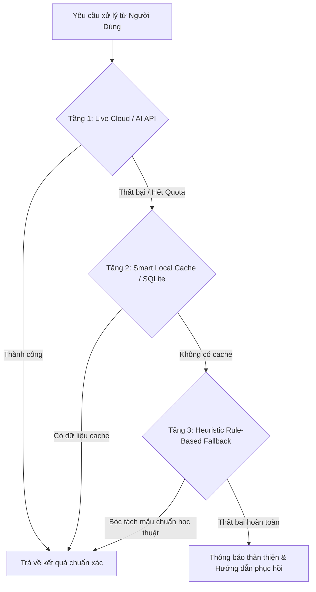

# 🛡️ Zero-Regression Engineering & Resilient Architecture Skill

Cẩm nang phương pháp luận kỹ thuật phần mềm dành cho các hệ thống quy mô lớn và phức tạp, đảm bảo mọi lần nâng cấp tính năng mới **không bao giờ làm hỏng hay cắt bỏ các tính năng đã ổn định trước đó**.

---

## 🏛️ 1. Nguyên Tắc Cốt Lõi: Tỉ Mỉ, Bảo Tồn & Không Phá Hỏng

1. **Nguyên Tắc Bổ Sung Không Xâm Lấn (Additive & Non-Destructive Principle)**:
   - Khi thêm tính năng mới, luôn thiết kế dưới dạng tham số mở rộng với giá trị mặc định giữ nguyên hành vi cũ (`standalone: bool = False`, `fallback: bool = True`).
   - Tuyệt đối không xóa bỏ các trường dữ liệu, thuộc tính hoặc hàm tiện ích mà các mô đun khác đang phụ thuộc.
2. **Khả Năng Tương Thích Ngược Tuyệt Đối (100% Backward Compatibility)**:
   - Nếu thay đổi cấu trúc dữ liệu trả về, luôn duy trì các key cũ song song với các key mới (Ví dụ: `gen0_count`, `gen1_count` vẫn được giữ nguyên bên cạnh `r1_count`, `f1_count`).
3. **Quy Trình Kiểm Tra Bắt Buộc Trước Khi Commit (Pre-Flight Verification)**:
   - Không chỉ kiểm tra tính năng mới chạy được, mà phải chạy lại **100% các bộ kiểm thử tự động của toàn bộ hệ thống**.

---

## ⚙️ 2. Mô Hình Thiết Kế Đa Tầng Dự Phòng (Multi-Tier Fallback Resilience)

Trong các ứng dụng dựa trên AI, API bên thứ ba hoặc dữ liệu mạng (như OpenAlex, LLM API, PDF Parser), sự cố mạng hoặc rate-limit là điều không thể tránh khỏi. Hệ thống phải luôn có 3 tầng bảo vệ:

1. **Tầng 1 (Live AI/API)**: Gọi trực tiếp API với cơ chế Retry có backoff theo cấp số nhân.
2. **Tầng 2 (Smart Local Cache)**: Tự động lưu cache kết quả vào SQLite/Local DB để nạp lại tức thì trong $0.1\text{s}$ mà không cần tốn quota API.
3. **Tầng 3 (Heuristic Deterministic Fallback)**: Nếu AI không phản hồi, dùng các biểu thức chính quy (Regex) và thuật toán phân tích cú pháp tĩnh để trích xuất dữ liệu cốt lõi, không để người dùng gặp màn hình trắng.

---

## 🧪 3. Quy Chuẩn Xây Dựng Bộ Test Suites Toàn Diện

Mỗi dự án cần duy trì tối thiểu 5 bộ test tự động độc lập:

| Bộ Test | Mục Đích | Chỉ Số Đạt Yêu Cầu |
| :--- | :--- | :--- |
| `test_system_upgrades_pro.py` | Kiểm tra tất cả các mô đun nghiệp vụ cốt lõi (Export, PDF Mining, Burst, Matrix, Slide PPTX, Cache) | 100% Passed (8/8 Modules) |
| `test_themes_contrast.py` | Kiểm định độ tương phản màu sắc của toàn bộ các theme theo tiêu chuẩn quốc tế **WCAG AAA/AA** | Contrast Ratio $\ge 7:1$ (Text thường) & $\ge 4.5:1$ (Text lớn) |
| `test_pipeline.py` | Kiểm tra luồng xử lý đầu-cuối (End-to-End Pipeline) từ DOI đầu vào tới tài liệu đầu ra | 100% Passed |
| `test_auth_commercial.py` | Kiểm thử bảo mật: Đăng nhập Super Admin, Đổi pass lần đầu, Chặn email trái phép, Reset pass qua Token, Audit Logs | 100% Security Rules Enforced |
| `test_standalone_viewport.py` | Kiểm tra chế độ hiển thị độc lập đa màn hình ($100\text{vh}$, ẩn bottom deck, Blob URL) | 100% Passed |

---

## 🔐 4. Tiêu Chuẩn Bảo Mật & Phân Quyền Doanh Nghiệp (Enterprise RBAC)

1. **Phân Quyền Vai Trò (Role-Based Access Control - RBAC)**:
   - `super_admin`: Toàn quyền quản trị, thêm bớt tài khoản, xem toàn bộ Audit Logs.
   - `researcher` / `guest`: Chỉ truy cập vào không gian nghiên cứu và tài liệu của mình.
2. **Cơ Chế Bắt Buộc Đổi Mật Khẩu Lần Đầu (`must_change_password`)**:
   - Mọi tài khoản mới tạo với mật khẩu tạm bắt buộc phải đổi mật khẩu ngay trong lần đăng nhập đầu tiên trước khi được phép vào ứng dụng.
3. **Nhật Ký Kiểm Toán Bất Biến (Immutable Audit Logs)**:
   - Mọi thao tác: Đăng nhập, Đổi mật khẩu, Yêu cầu Token khôi phục, Thêm người dùng đều được ghi lại vào bảng `audit_logs` với `timestamp`, `email`, `action_type`, `details` để truy vết khi có sự cố.

---

## 🛠️ 5. Checklist Vàng Cho Kỹ Sư Khi Phát Triển Tính Năng Mới

- [ ] **Bước 1**: Đọc kỹ yêu cầu và khảo sát toàn bộ các file liên quan trước khi chỉnh sửa.
- [ ] **Bước 2**: Xác định các hàm/biến sẽ bị ảnh hưởng, đảm bảo không thay đổi chữ ký hàm cũ trừ khi có giá trị mặc định.
- [ ] **Bước 3**: Viết mã mới tỉ mỉ, xử lý đầy đủ các trường hợp ngoại lệ (`try...except`).
- [ ] **Bước 4**: Kiểm tra cú pháp bytecode: `python -m py_compile <file_names>`.
- [ ] **Bước 5**: Chạy toàn bộ 100% các file test script hiện có.
- [ ] **Bước 6**: Viết thêm test script kiểm thử riêng cho tính năng mới vừa tạo.
- [ ] **Bước 7**: Cập nhật tài liệu kỹ thuật / Walkthrough và commit Git với thông điệp chuẩn hóa.
