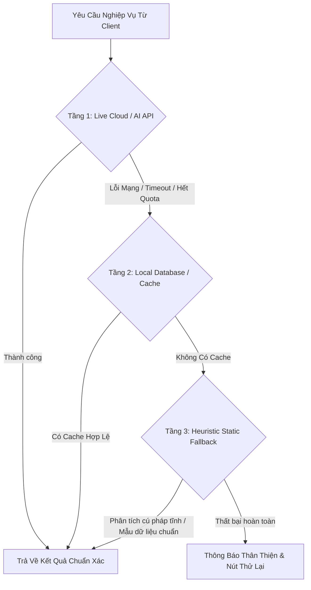

# 🛡️ Zero-Regression Software Engineering & Resilient Architecture Handbook

Cẩm nang phương pháp luận kỹ thuật phần mềm chuẩn doanh nghiệp, đúc kết các nguyên tắc tối thượng nhằm đảm bảo quá trình phát triển, nâng cấp và mở rộng hệ thống **không bao giờ làm hỏng, cắt xén hay suy giảm bất kỳ tính năng nào đã hoạt động ổn định trước đó**, áp dụng cho mọi ngôn ngữ lập trình (Python, TypeScript, JavaScript, Rust, Go) và mọi nền tảng (Web App, Mobile Web, Desktop, Cloud Microservices).

---

## 🏛️ 1. Nguyên Tắc Vàng Bảo Toàn Tính Năng (The Law of Non-Destructive Additions)

Trong kỹ thuật phần mềm phức tạp, việc bổ sung tính năng mới thường tiềm ẩn nguy cơ "gãy vỡ vô hình" (Silent Regression). Để triệt tiêu rủi ro này, mọi kỹ sư phải tuân thủ 4 quy tắc sắt:

### A. Quy Tắc Bổ Sung Không Xâm Lấn (Additive-Only Changes)
- Khi mở rộng một hàm, lớp hoặc API, **luôn sử dụng tham số tùy chọn kèm giá trị mặc định** bảo toàn hành vi cũ:
  ```python
  # ✅ ĐÚNG: Giữ nguyên hành vi cũ nếu không truyền tham số mới
  def render_graph_view(nodes, edges, standalone_mode: bool = False, speed_factor: float = 1.0, **kwargs):
      ...
  
  # ❌ SAI: Thay đổi bắt buộc thứ tự hoặc xóa bỏ tham số cũ làm gãy code ở nơi khác
  def render_graph_view(nodes, edges, new_config_object):
      ...
  ```
- **Không bao giờ xóa bỏ các trường dữ liệu (Fields/Keys)** trong các cấu trúc JSON hoặc bảng cơ sở dữ liệu. Nếu cần đổi tên, hãy duy trì trường cũ song song với trường mới (Dual-Key Compatibility).

### B. Quy Tắc Bọc Lớp Trừu Tượng (The Decorator/Wrapper Pattern)
- Thay vì sửa đổi trực tiếp vào khối mã nguồn cốt lõi đang chạy mượt mà, hãy xây dựng một lớp bọc (Wrapper) bên ngoài để mở rộng hành vi mà không can thiệp vào logic bên trong.

### C. Nguyên Tắc Khóa Phiên Bản Phòng Thủ (Version Shielding & Branch Guarding)
- Trước khi bắt đầu một giai đoạn nâng cấp lớn (ví dụ: chuyển từ Local sang Cloud/Mobile):
  1. Gắn thẻ Git Tag cố định (ví dụ: `v3.5.0-local-stable`).
  2. Tạo phân nhánh bảo vệ (`backup-local-stable`) để có thể rollback tức thì trong 1 giây nếu phát sinh sự cố.
  3. Lập biên bản phát hành (Release Notes Snapshot) ghi nhận danh sách tính năng và kết quả kiểm thử.

---

## ⚙️ 2. Kiến Trúc Đa Tầng Dự Phòng (Multi-Tier Fallback Architecture)

Một phần mềm chất lượng cao không bao giờ được phép "treo cứng" hoặc "màn hình trắng" khi một dịch vụ bên ngoài (AI API, Mạng, Dữ liệu đám mây) gặp sự cố. Bắt buộc phải triển khai mô hình 3 tầng phòng thủ:



1. **Tầng 1 (Live AI/API)**: Gọi API trực tuyến với cơ chế Retry có backoff theo cấp số nhân (Exponential Backoff).
2. **Tầng 2 (Smart Local Cache / Database)**: Tự động lưu trữ bản snapshot vào SQLite/IndexedDB/Redis. Nếu API lỗi, nạp lại kết quả cache trong $0.1\text{s}$.
3. **Tầng 3 (Heuristic Deterministic Fallback)**: Dùng các thuật toán bóc tách tĩnh, biểu thức chính quy (Regex) và mẫu quy chuẩn để sinh dữ liệu dự phòng có cấu trúc hợp lệ.

---

## 🔒 3. An Toàn Chuỗi Nội Suy Đa Ngôn Ngữ (Cross-Language Escaping Safety)

Khi một ngôn ngữ backend (Python, Node.js) sinh ra mã cho một ngôn ngữ khác (HTML, JavaScript, CSS, LaTeX):

### 🚨 Cạm Bẫy Nguy Hiểm: Xung Đột Ký Tự Đặc Biệt
- **Trong Python f-strings (`f"""..."""`)**:
  - Dấu ngoặc nhọn `{` và `}` trong CSS (`@media { ... }`) hoặc JavaScript (`function() { ... }`) **bắt buộc phải thoát ký thành `{{` và `}}`**.
  - Không chèn chuỗi chứa ký tự `{...}` chưa thoát (ví dụ: cú pháp LaTeX `\text{Citations}`) trực tiếp vào f-string vì Python sẽ cố phân tích thành biến và gây lỗi `NameError`.
- **Trong Streamlit Markdown (`st.markdown`)**:
  - Tuyệt đối không để thụt lề 4 dấu cách (4 spaces) sau một dòng trống trong chuỗi HTML vì bộ phân tích cú pháp Markdown sẽ hiểu nhầm là Code Block (`<pre><code>`) và hiển thị HTML thô ra màn hình.
- **Trong Mở Cửa Sổ Trình Duyệt Mới (`window.open`)**:
  - Không sử dụng `data:text/html;base64` cho điều hướng cấp cao (bị trình duyệt chặn bảo mật). Luôn dùng **W3C Blob URL** (`URL.createObjectURL(new Blob(...))`).

---

## 🧪 4. Quy Chuẩn Kiểm Thử Tự Động Toàn Diện (The 5-Pillar Test Suite)

Mọi dự án phần mềm chuyên nghiệp bắt buộc phải xây dựng hệ thống kiểm thử tự động gồm 5 trụ cột:

| Trụ Cột Kiểm Thử | Mục Tiêu Kiểm Định | Tiêu Chuẩn Vượt Qua (Passing Criteria) |
| :--- | :--- | :--- |
| **1. Unit & Syntax Test** | Biên dịch bytecode, kiểm tra cú pháp toàn bộ tệp mã nguồn | `python -m py_compile` 100% không có lỗi |
| **2. Core Business Test** | Kiểm tra toàn bộ các hàm nghiệp vụ, trích xuất dữ liệu, xuất file (PDF, Excel, LaTeX, Slide PPTX) | 100% Modules Passed |
| **3. UI & Contrast Test** | Kiểm tra độ tương phản màu sắc toàn bộ giao diện theo chuẩn quốc tế **WCAG AAA/AA** | Contrast Ratio $\ge 7:1$ (Normal text), $\ge 4.5:1$ (Large text) |
| **4. Integration & E2E Test** | Kiểm tra luồng dữ liệu đầu-cuối từ Input đầu vào tới Output đầu ra | Luồng chạy trơn tru với cả dữ liệu đầy đủ lẫn dữ liệu khiếm khuyết |
| **5. Cross-Device Viewport Test**| Kiểm tra tính toàn vẹn giao diện trên Mobile ($360\text{px}$), Tablet ($768\text{px}$), Desktop ($1440\text{px}$) và Ultra-Wide | Không vỡ layout, không tràn ngang, fit $100\text{vh}$ |

---

## 🔐 5. Tiêu Chuẩn Bảo Mật & Phân Quyền Doanh Nghiệp (Enterprise RBAC)

1. **Phân Quyền Theo Vai Trò (Role-Based Access Control - RBAC)**:
   - Tách biệt rõ ràng quyền hạn giữa Quản trị viên (`super_admin`), Chuyên viên (`researcher`), và Khách (`guest`).
2. **Cơ Chế Bắt Buộc Đổi Mật Khẩu Lần Đầu (`must_change_password`)**:
   - Tài khoản cấp mới với mật khẩu tạm phải bị chặn truy cập nghiệp vụ cho đến khi hoàn tất đổi mật khẩu an toàn.
3. **Nhật Ký Kiểm Toán Bất Biến (Immutable Audit Logging)**:
   - Ghi nhận mọi hành vi trọng yếu (Đăng nhập, Thay đổi cấu hình, Xuất dữ liệu, Phục hồi mật khẩu) kèm thời gian thực và định danh người dùng.

---

## 🛠️ 6. Checklist Vàng Cho Kỹ Sư Phần Mềm (Pre-Commit Golden Checklist)

Trước khi xác nhận hoàn thành bất kỳ nhiệm vụ nào:
- [ ] **1. Rà soát tương thích ngược**: Không sửa/xóa chữ ký hàm cũ, không xóa trường dữ liệu cũ.
- [ ] **2. Kiểm tra chuỗi thoát ký**: Đảm bảo toàn bộ dấu `{`, `}` trong mã nhúng đã được thoát ký chính xác.
- [ ] **3. Kiểm tra cú pháp toàn diện**: Chạy trình biên dịch bytecode cho 100% file mã nguồn.
- [ ] **4. Chạy lại 100% bộ Test Suites**: Đảm bảo tất cả các bài kiểm thử cũ và mới đều đạt điểm xanh (All Passed).
- [ ] **5. Kiểm tra trải nghiệm thực tế**: Thử nghiệm trên màn hình nhỏ (Mobile) và màn hình lớn (Desktop).
- [ ] **6. Cập nhật tài liệu kỹ thuật**: Ghi chú rõ các thay đổi và gắn nhãn commit chuẩn mực.
